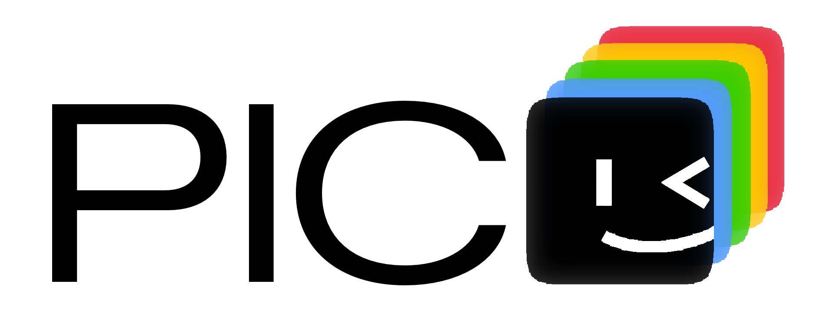
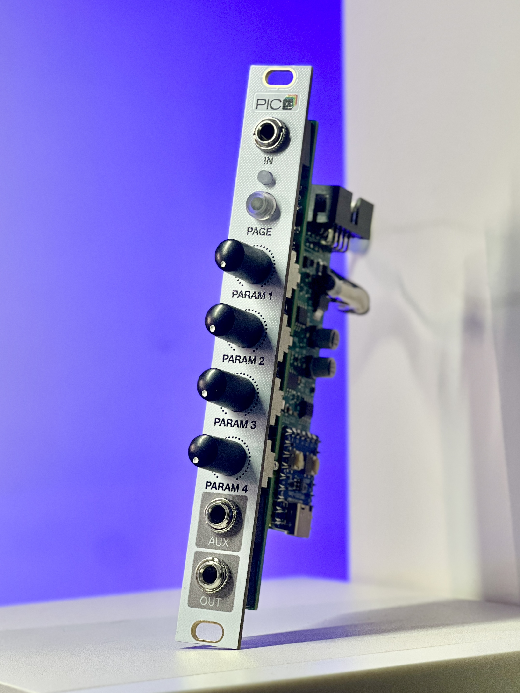
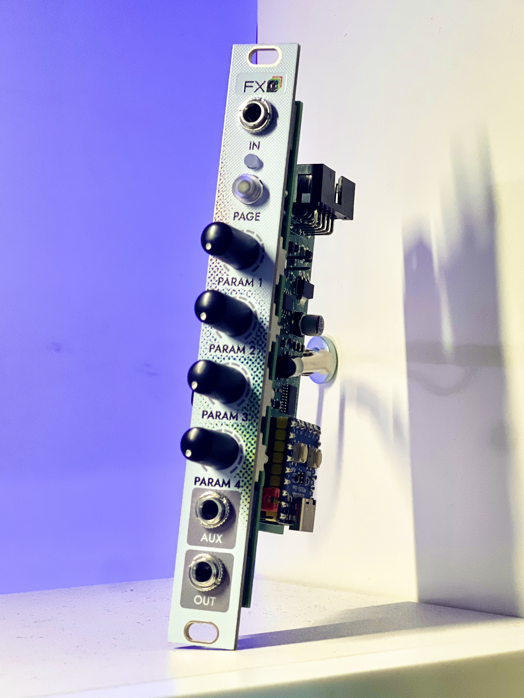

# Pico-Eurorack

Arduino sketches for `2HPico` and `2HPico DSP` Eurorack modules; source code lives in `Sketches/` and prebuilt `uf2` firmware lives in `Build/`.

This is an alternative set of sketches for the 2HPico and 2HPico DSP modules by rich hesslip. See the original sketches at: 
https://github.com/rheslip/2HPico-DSP-Sketches; 
https://github.com/rheslip/2HPico-Sketches;

What's the difference?
more sketches;
more color options; 
easy-to-use calibration sketches;
Unified file structure for both Pico and PicoFX sketches;

## Pico

1. 16Step_Sequencer: a 16-step CV/Gate sequencer with per-step ratchets, scale quantization, clock division, length, and overall pitch;
2. Branches: a Bernoulli gate inspired by "Mutable Instruments Branches", routes one trigger input to two mutually exclusive outputs with probability；
3. Braids:  macro-oscillator inspired by "Mutable Instruments Braids" offers multiple  models with ADSR control;
4. DRUMS: multi-model drum voice that icludes 808 kick, 909 kick, 808 snare, 909 snare, and hi-hat engines;
5. DejaVu: a semi-random sequencer with a "DejaVu" memory control that captures and re-injects note/gate patterns to balance repetition and variation;
6. DualClock: a dual clock generator/divider with tap tempo, swing, random timing, and linked clock ratios;
7. Grids_Sampler: a drum machine that combines "Mutable Instruments Grids" rhythm generation with four-channel sample playback;
8. Modal: a modal resonator inspired by "Mutable Instruments Rings" that excites resonant structures from trigger and pitch CV input;
9. Modulation: a combined ADSR and LFO modulation source that switches between envelope mode and multi-waveform syncable LFO mode;
10. Moogvoice: a monophonic subtractive synth voice with three oscillators, a Moog-style ladder filter, ADSR envelope, and LFO modulation;
11. Motion_Recorder: a dual-channel CV motion recorder that loops knob movements, synchronizes to an external clock, and supports queued re-recording;
12. Oneshot_Sampler: a one-shot sampler with V/Oct pitch control, envelope shaping, tone control, sample randomization, and reverse playback;
13. Plaits: macro-oscillator inspired by "Mutable Instruments Plaits";
14. PlaitsFM: 6OP-FM-oscillator inspired by "Mutable Instruments Plaits";
15. TripleOSC: a compact three-oscillator voice with shared waveform selection, independent tuning, FM input, and per-oscillator mute/calibration support;

## PicoFX

1. Chorus: a stereo chorus effect with delay, feedback, LFO rate/depth, wet/dry mix, and output level control;
2. Delay: a delay effect with feedback, wet/dry mix, output level, and either free delay time or external-clock sync plus ping-pong mode;
3. Flanger: a stereo flanger with delay, feedback, LFO depth/rate, stereo width, and multiple modulation waveforms;
4. Pitchshifter: a pitch shifter with adjustable delay window, transposition, random modulation, and wet/dry mix;
5. Reverb: a stereo reverb with controllable decay time, low-pass damping, wet/dry mix, and output level;
6. Granular: a granular processor that chops incoming audio into grains with adjustable size, density, pitch, and wet/dry mix;
7. Ladderfilter: a Moog ladder low-pass filter effect with resonance, base cutoff, 1V/Oct cutoff CV scaling, and output level control;
8. Panner: a stereo spreader/autopanner that moves mono input across the stereo field with adjustable width, rate, LFO shape, and output level;
9. Sidechain: a trigger-ducking sidechain effect with adjustable attack, decay, curve, and output level;

## Test
1. Button: a simple hardware test that cycles the front-panel RGB LED color each time the button is pressed;
2. Calibration: a DAC calibration helper that outputs fixed reference voltages on both CV outputs for tuning Pico;

## Credits
- Rich Hesslip for the original 2HPico and 2HPico DSP libraries and sketches;
- Mutable Instruments for the original modules that inspired many of these sketches;
- The open-source Arduino and TinyUSB communities for the tools that make this possible;
- SYNSO for the DRUMS sketch;
- You for checking this out and supporting open-source Eurorack development~